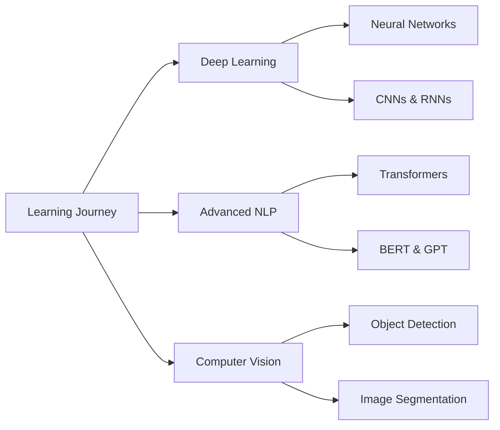

# Hi there, I'm Gehad Abdulaziz 👋

<div align="center">
  
  [](https://git.io/typing-svg)
  
  
  [](https://linkedin.com/in/gehad-abdulaziz-228973287)
  
</div>

---

## 🚀 About Me

```python
class GehadAbdulaziz:
    def __init__(self):
        self.name = "Gehad Abdulaziz"
        self.role = "Software Engineer | Data Scientist"
        self.education = "Computer Science @ Helwan University"
        self.location = "Egypt 🇪🇬"
        self.passions = ["Machine Learning", "Data Science", "Web Development"]
        self.current_focus = "Deep Learning & NLP"
        
    def say_hi(self):
        print("Thanks for dropping by! Let's build something amazing together 🌟")

me = GehadAbdulaziz()
me.say_hi()
```

🎓 **Computer Science Student** passionate about transforming data into actionable insights and building intelligent systems.

🔬 **Machine Learning Enthusiast** with hands-on experience in classification, regression, clustering, computer vision, and NLP.

💻 **Full-Stack Developer** skilled in creating user-friendly web applications with modern technologies.

---

## 🛠️ Tech Stack

### 🧠 Data Science & Machine Learning


### 🌐 Web Development


### 🧰 Tools & Technologies


---

## 🌟 Featured Projects

<table>
<tr>
<td width="50%">

### 🩺 Customer Churn Prediction
**Identifying At-Risk Customers Using Advanced ML**

- 📊 Advanced EDA & Feature Engineering
- 🤖 Multiple Classification Models
- 🎯 Model Optimization & Hyperparameter Tuning
- 📈 95%+ Accuracy Achievement

[](https://github.com/gehad-abdulaziz/Customer-churn-prediction)

</td>
<td width="50%">

### 🦠 Virus B Detection
**DEPI Graduation Project**

- 🔬 Medical Image Analysis
- 🧪 Deep Learning for Disease Detection
- 📉 Data Preprocessing Pipeline
- 🎓 Team Collaboration

[](#)

</td>
</tr>

<tr>
<td width="50%">

### ❤️ Heart Disease Prediction
**Complete ML Pipeline**

- 🩺 UCI Heart Disease Dataset
- 🔄 Full Pipeline: Preprocessing → Training → Evaluation
- 🌲 Random Forest, SVM, Logistic Regression
- 📊 K-Means & Hierarchical Clustering

[](https://github.com/gehad-abdulaziz/Full-Machine-Learning-Pipeline-on-Heart-Disease-Dataset)

</td>
<td width="50%">

### 🏥 Hospital Management System
**PHP & MySQL Web Application**

- 👨‍⚕️ Patient & Doctor Management
- 📅 Appointment Scheduling
- 💊 Medicine Tracking
- 🎨 User-Friendly Interface

[](https://github.com/gehad-abdulaziz/Hospital-DB-with-PHP-UI)

</td>
</tr>

<tr>
<td width="50%">

### 🖼️ Computer Vision Projects
**Object Detection & Image Classification**

- 🐕🐈 Dog vs Cat Classifier
- 👤 Human Face Detection
- 🔢 MNIST Digit Recognition
- 🧠 CNN & Transfer Learning

</td>
<td width="50%">

### 💬 NLP & Text Analysis
**Natural Language Processing**

- 🆘 Disaster Tweets Classification
- 📝 Text Preprocessing & Tokenization
- 🎯 Sentiment Analysis
- 🔤 Feature Extraction (TF-IDF, Word2Vec)

</td>
</tr>
</table>

---

## 📊 GitHub Statistics

<div align="center">
  
  
  
  
</div>

<div align="center">
  
  [](https://git.io/streak-stats)
  
</div>

---

## 🎯 Current Focus



🌱 **Currently Learning:**
- 🔥 Deep Learning with TensorFlow & PyTorch
- 🤖 Advanced NLP Techniques
- 📸 Computer Vision & Object Detection
- ☁️ MLOps & Model Deployment

---

## 🏆 Achievements & Certifications

- 🎓 **DEPI Graduation Project** - Virus B Detection
- 🎓 **NTI Graduation Project** - Customer Churn Prediction
- 📚 **Multiple Machine Learning Coursework Projects**
- 🚀 **NASA Hackathon Participant**
- 💻 **50+ ML & Web Development Projects**

---

## 📈 Activity Graph

[](https://github.com/gehad-abdulaziz)

---

## 💡 Random Dev Quote

<div align="center">


</div>

---

## 🤝 Let's Connect!

<div align="center">
  
  [](https://linkedin.com/in/gehad-abdulaziz-228973287)
  [](https://github.com/gehad-abdulaziz)
  [](#)
  
  <br>
  
  **💌 Open to collaborations, freelance projects, and interesting opportunities!**
  
  <br>
  
  
  
</div>

---

<div align="center">
  
  ### ⭐ Show some love by starring some repositories!
  
  **"Data is the new oil, but insights are the new gold." 🌟**
  
</div>
