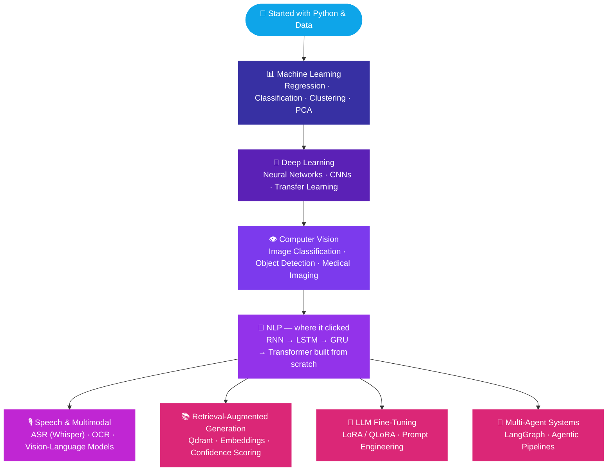

<div align="center">


<a href="https://readme-typing-svg.demolab.com">

</a>

<br>

<a href="https://linkedin.com/in/gehad-abdulaziz-228973287"></a>
<a href="mailto:gehadabdelaziz179@gmail.com"></a>
<a href="https://www.kaggle.com/gehadabdulaziz"></a>
<a href="https://github.com/gehad-abdulaziz?tab=repositories"></a>


<br><br>

<!-- 🐍 Contribution snake — activates automatically after the included workflow runs once, see setup note near the bottom -->


</div>

<br>

```py
class NLPEngineer:
    def __init__(self):
        self.name         = "Gehad Abdulaziz Ibrahim"
        self.role         = "NLP Engineer · LLM & Generative AI"
        self.base         = "Giza, Egypt 🇪🇬"
        self.education    = "B.Sc. Computer Science (AI Track) — Helwan University, GPA 3.84"
        self.languages    = {"Arabic": "Native", "English": "Professional Working Proficiency"}
        self.currently_at = "DEPI — Agentic AI & GenAI System Developer Trainee"
        self.stack        = ["LangGraph", "Hugging Face", "Qdrant", "FastAPI", "PyTorch", "MLflow"]

    def philosophy(self):
        return "I don't just build models that answer — I build systems that know when NOT to."

me = NLPEngineer()
print(me.philosophy())
```

<br>

## 🧠 About Me

I'm an **AI & NLP Engineer** who builds production-minded systems on top of Large Language Models — not just prompt wrappers, but pipelines that reason about their own confidence before they speak.

<table>
<tr>
<td width="50%" valign="top">

**🔭 Right now, I'm...**
- Engineering **AraCheck** — a tiered LLM → RAG → Web-Search escalation pipeline that only reaches for more evidence when it's genuinely unsure
- Building **clinical speech intelligence** — ASR + zero-shot NER pipelines that transcribe *and* understand medical audio
- Deep in an **Agentic AI & GenAI System Developer** track at DEPI — LangGraph, multi-agent orchestration, deployment & monitoring

</td>
<td width="50%" valign="top">

**🌱 What drives me**
- Native Arabic speaker building **Arabic-first NLP** — because most of the field forgets my language exists
- Obsessed with **calibrated confidence** over confident-sounding nonsense
- Believer in evidence-grounded AI: every answer should be able to point at *why*

</td>
</tr>
</table>

> 💬 **Ask me about:** RAG architecture · confidence calibration · transformer internals · multi-agent orchestration · why your chatbot is hallucinating

---

## 🗺️ My Learning Journey — From Classical ML to Agentic AI

<div align="center">


```mermaid
graph TD
    START(["🌱 Started with Python & Data"]) --> ML

    ML["📊 Machine Learning
    Regression · Classification · Clustering · PCA"] --> DL

    DL["🧠 Deep Learning
    Neural Networks · CNNs · Transfer Learning"] --> CV

    CV["👁️ Computer Vision
    Image Classification · Object Detection · Medical Imaging"] --> NLP

    NLP["💬 NLP — where it clicked
    RNN → LSTM → GRU → Transformer built from scratch"] --> SPEECH
    NLP --> RAG
    NLP --> LLM
    NLP --> AGENT

    SPEECH["🎙️ Speech & Multimodal
    ASR (Whisper) · OCR · Vision-Language Models"]
    RAG["📚 Retrieval-Augmented Generation
    Qdrant · Embeddings · Confidence Scoring"]
    LLM["🔧 LLM Fine-Tuning
    LoRA / QLoRA · Prompt Engineering"]
    AGENT["🤖 Multi-Agent Systems
    LangGraph · Agentic Pipelines"]

    style START fill:#0EA5E9,color:#fff,stroke:#0EA5E9
    style ML fill:#3730a3,color:#fff,stroke:#3730a3
    style DL fill:#5b21b6,color:#fff,stroke:#5b21b6
    style CV fill:#7c3aed,color:#fff,stroke:#7c3aed
    style NLP fill:#9333ea,color:#fff,stroke:#9333ea
    style SPEECH fill:#c026d3,color:#fff,stroke:#c026d3
    style RAG fill:#db2777,color:#fff,stroke:#db2777
    style LLM fill:#db2777,color:#fff,stroke:#db2777
    style AGENT fill:#db2777,color:#fff,stroke:#db2777
```

*Every stage still lives in my toolbox — NLP is where the path forked into what I do now: RAG, LLM fine-tuning, and agentic systems, with speech & multimodal AI running alongside.*

</div>

---

## 🛠️ Tech Stack

<div align="center">

**LLMs & Agentic AI**
<br>


**Deep Learning & NLP**
<br>


**Speech & Multimodal**
<br>


**Serving & Tooling**
<br>


</div>

<details>
<summary><b>📈 Skill depth (click to expand)</b></summary>
<br>

| Area | Proficiency |
|---|---|
| NLP & Text Understanding | `█████████░` 90% |
| LLMs & Agentic AI (RAG, LangGraph) | `████████░░` 85% |
| Deep Learning (RNN/Transformer from scratch) | `████████░░` 80% |
| Speech & Multimodal (ASR, VLM, OCR) | `███████░░░` 75% |
| Classical ML (scikit-learn) | `████████░░` 80% |
| Web Dev (PHP, MySQL, JS) | `██████░░░░` 65% |

</details>

---

## 🚀 Featured Work

### 🩺 AraCheck — Bilingual Medical RAG Assistant
**Confidence-aware retrieval so the model knows when to look further before it answers**

An agentic pipeline (LangGraph) that escalates a medical query through LLM → RAG → web-search — only climbing tiers when confidence is genuinely low, cutting down on hallucinated answers. Built the retrieval core: `BAAI/bge-m3` embeddings, Qdrant vector search, cross-encoder reranking, and a **margin-based confidence score** instead of a fixed similarity cutoff. Helped fold voice (Whisper) and image understanding (VLM) into one chat pipeline with numbered source citations.

`Python` `FastAPI` `LangGraph` `Qdrant` `Hugging Face` `Groq API` `Next.js`

---

### 🎙️ Medical ASR v6 — Multi-Specialty Clinical Speech Recognition
**Transcription that understands what it just heard**

End-to-end pipeline pairing `faster-whisper large-v3` with **zero-shot NER (GLiNER)** to pull 9 clinical entity types with no task-specific retraining. Auto-detects the medical specialty from the audio to route it to specialty-aware prompts, and grades every transcript A–D on ASR/NER confidence for clinical review. Shipped as a Streamlit app with live recording, file upload, and confidence-highlighted text.

`Python` `faster-whisper` `GLiNER` `Hugging Face` `Streamlit`

---

### 🔗 Multi-Task BiRNN — One Encoder, Four GLUE Tasks
**73.45% accuracy sharing a single brain across sentiment, paraphrase, duplicate-detection & NLI**

A shared bidirectional RNN with an ESIM-style soft-alignment (attention) layer, trained jointly across SST-2, MRPC, QQP, and MNLI. Got there through staged improvements — added capacity, soft alignment, more data — and stabilized training with label smoothing, gradient clipping, and stochastic weight averaging. Packaged as a live Gradio demo.

`PyTorch` `GloVe` `Gradio`

---

### 🔍 Food Reviews Semantic Search Engine
**Search by meaning, not keywords — over 3,000 Amazon food reviews**

Led a 6-member team and owned the data pipeline for a semantic search engine, then benchmarked a TF-IDF/cosine baseline against Sentence-Transformer embeddings using Precision@5.

`Python` `scikit-learn` `Sentence-Transformers`

<div align="center">

[](https://github.com/gehad-abdulaziz?tab=repositories)

</div>

---

## 🎓 Path So Far

```text
2023 ─── B.Sc. Computer Science (AI Track) begins @ Helwan University
2025 ─── Data Science Trainee @ DEPI — Python, ML, MLOps foundations
2025 ─── Machine Learning — DEY Upskilling Programs
2026 ─── Deep Learning for Computer Vision — DEY Upskilling Programs
2026 ─── NLP 90-Hour Track @ NTI — Transformers built from scratch, Arabic NLP
2026 ─── AI & Data Science Trainee — Agentic AI & GenAI System Developer @ DEPI  ← now
2027 ─── Graduating — focus: NLP & LLMs
```

**Currently building:** Confidence-aware agentic RAG · Multi-agent orchestration with LangGraph · Production LLM deployment & monitoring

---

## 🏆 Trophies & Stats

<div align="center">


<br>


</div>

---

## 🗣️ Languages

<div align="center">

| 🇪🇬 Arabic | 🇬🇧 English |
|:---:|:---:|
| Native `██████████` | Professional `████████░░` |

</div>

---

## 🌐 Let's Talk NLP

<div align="center">

I'm always up for collaborating on RAG systems, agentic pipelines, or Arabic NLP — reach out.

<a href="https://linkedin.com/in/gehad-abdulaziz-228973287"></a>
<a href="mailto:gehadabdelaziz179@gmail.com"></a>
<a href="https://www.kaggle.com/gehadabdulaziz"></a>

<br><br>

<i>"Every answer should be able to point at why."</i>

<br><br>


</div>
